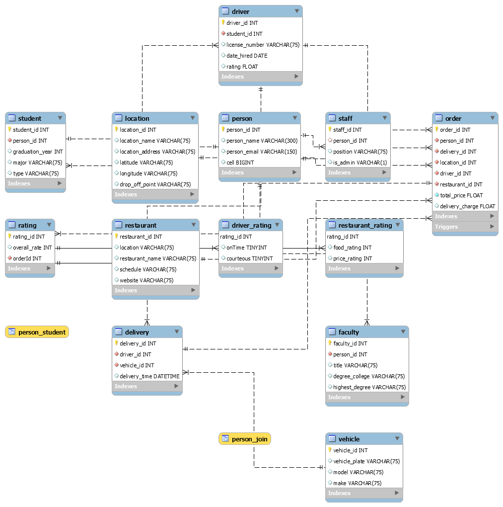

# 3160project
ITSC 3135, GROUP 5

 **Introduction (Team, Project Description)**
 
      Team: Thomas Bilbao, Nanayaw Boakye, Daniel Camacho, Benson Huynh, and Isabella Ochsner
      
      Project Description: In this project students are to understand a test database for a campus controlled food delivery service similar to craveoncampus.com. Students will then enhance the database with a rating system for both resturants and delivery drivers.

 **Use Case for Rating System**
  

  **Business Rules**

* Customers have the choice to rate a driver after a completed order for up to three days
* Customers will be able to view the rating of the driver delivering to them
* Customers will be able to rate the driver and restaurant individually
* Customers will be able to view the ratings of a restaurant
* Low ratings (< 2 stars) will be reviewed by administrator
  
  **EERD (full database)**

  **MySQL Queries**

  **Stored Procedure**

  **Web/App Implementation (Optional) or Description of Future Work**

  **MySQL dump**

  **Project Video**
